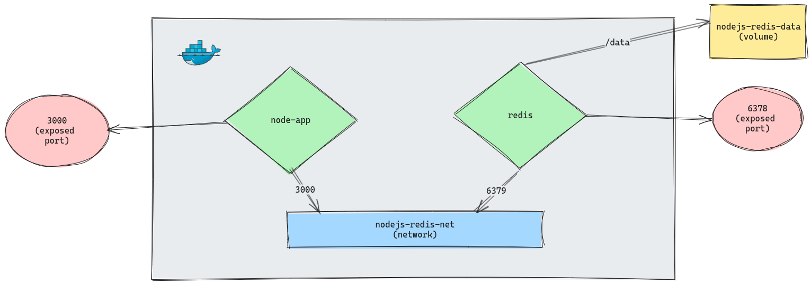

# NODEJS WITH REDIS

This is a simple example of a NodeJS application that uses Redis as a cache with Docker.

## Setup

```bash
# Clone the repository
git clone <repository-url>

# Go to the project directory
cd /caching/nodejs-redis

# Use Docker Compose to build the image and run the container
docker-compose up -d

# Access the application
http://localhost:3000

# To stop the container
docker-compose down
```

## Docker Setup Visual Representation



## Application

This API allows you to manage tags using Redis. It supports the following operations:

- `POST /tags`: Add a new tag.
- `GET /tags`: Retrieve all tags or search by prefix.
- `DELETE /tags/:tag`: Remove a specific tag.

You can test the API using tools like Postman, Insomnia, or the REST Client extension in VS Code.

> You can test the API using the `Postman` or `Insomnia` tools, or use `rest-client` extension in Visual Studio Code and use the `requests.rest` file in the project.
