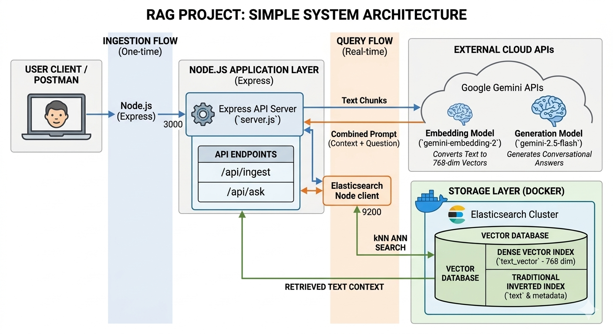

# Gemini & Elasticsearch RAG Backend

A high-performance Node.js Retrieval-Augmented Generation (RAG) backend utilizing Express, Elasticsearch (for dense vector kNN similarity search), and the Gemini API (for text embeddings and response generation). The seed dataset focuses on traditional Egyptian food recipes and culinary history.

## System Architecture



---

## Getting Started

### 1. Prerequisites
- **Node.js**: `v18.0.0` or higher (tested with `v22.14.0`)
- **Docker**: For running Elasticsearch locally

### 2. Environment Variables Configuration
Create a `.env` file in the root directory:
```env
PORT=3000
GEMINI_API_KEY=your_gemini_api_key_here
ELASTIC_NODE=http://localhost:9200
```

### 3. Installation & Database Setup
1. **Install dependencies**:
   ```bash
   npm install
   ```
2. **Start Elasticsearch**:
   ```bash
   docker-compose up -d
   ```

---

## Running the Application

### Clean/Reset Index (Optional)
If you need to clear the Elasticsearch index and start fresh:
```bash
npm run clean
```

### Ingest Dataset
Loads the seed data from `src/data/egyptian_food_data.json`, generates vector embeddings using Gemini, and indexes them into Elasticsearch:
```bash
npm run ingest
```

### Start Server
Run the Express server in development mode (with hot reloading and HTTP request logging):
```bash
npm run dev
```

---

## API Endpoints

### 1. Health Check
- **Endpoint**: `GET /health`
- **Description**: Returns the server status, current timestamp, and uptime.

### 2. Ingest Document
- **Endpoint**: `POST /api/ingest`
- **Payload**:
  ```json
  {
    "text": "Your custom text content here",
    "metadata": "optional-tag"
  }
  ```

### 3. Ask Question (RAG)
- **Endpoint**: `POST /api/ask`
- **Payload**:
  ```json
  {
    "question": "How do you make traditional Egyptian Koshary?"
  }
  ```
